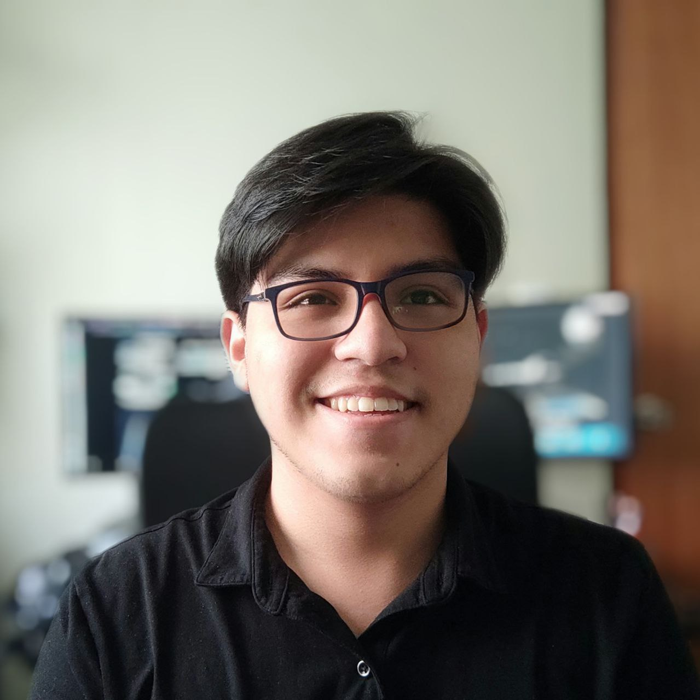

Fourth-year engineer student, future computer scientist. My passion for building through code brought me to the faculty of computer engineering at the Pontificia Universidad Catolica del Peru. 

I am a STEM instructor and also a tech enthusiast who aims to share and inspire people into robotics, tecnology and making up the future.
