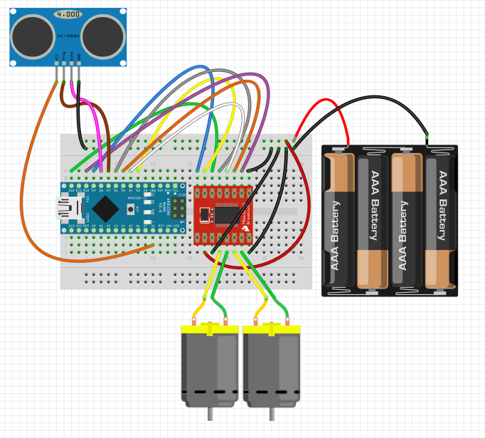
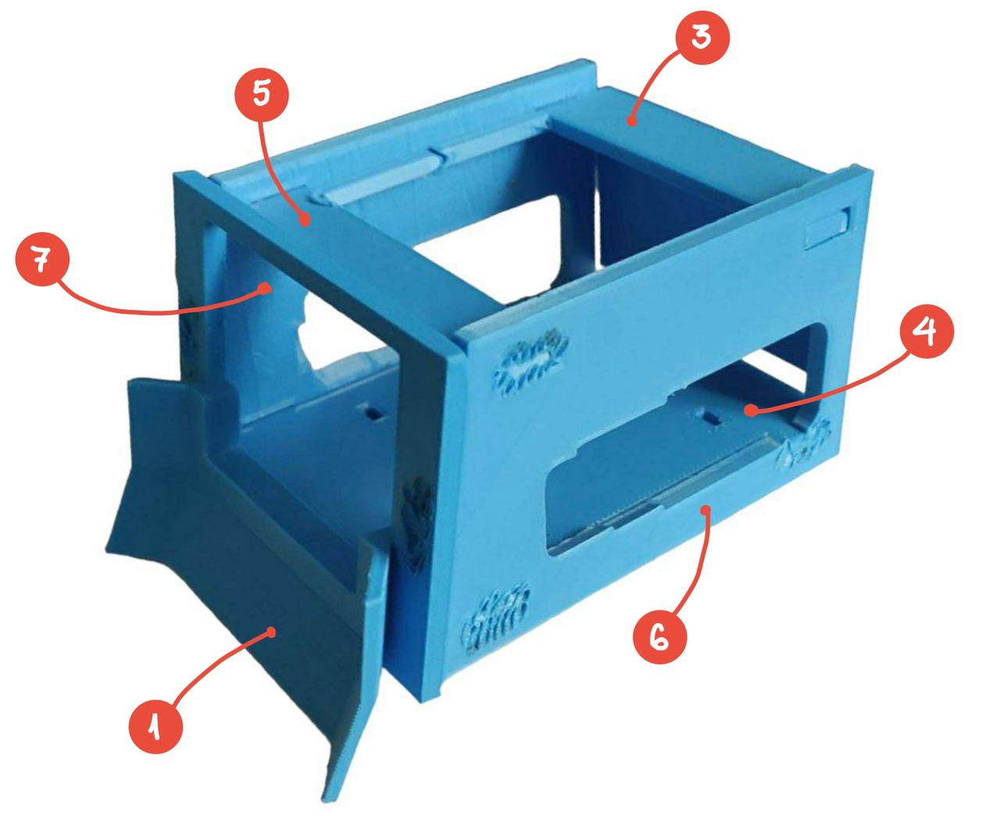

To build our bot we will need the following materials. In some cases we will be able to sustitute some of them but that wil depend on our budget and level of exepertise in order to handle those modifications.

# Electronics

{: style="width: 600px;"}

1. Arduino Nano
1. Motor Driver - TB6612FNG
1. Ultrasonic Sensor - HC-SR04
1. Infrared Sensor - TCRT5000
1. DC Motors (Yellow motor) (x2)
1. 4 slots battery case
1. AAA Batteries (x4)
1. Switch
1. Jumpers (wires)
1. Protoboard

# Mechanics
1. Wheels (x2)
1. Chasis 3D printed with PLA+

# 3D printed parts

{: style="width: 400px;"}

1. [front-pale](https://github.com/MarceJara/FutureBot-MiniSumoBot/blob/gh-pages/assets/3d_models/front_pale.stl)
1. [front-ramp](https://github.com/MarceJara/FutureBot-MiniSumoBot/blob/gh-pages/assets/3d_models/front_ramp.stl)
1. [sumo-back-ceiling](https://github.com/MarceJara/FutureBot-MiniSumoBot/blob/gh-pages/assets/3d_models/sumo_back_ceiling.stl)
1. [sumo-base](https://github.com/MarceJara/FutureBot-MiniSumoBot/blob/gh-pages/assets/3d_models/sumo_base.stl)
1. [sumo-front-ceiling](https://github.com/MarceJara/FutureBot-MiniSumoBot/blob/gh-pages/assets/3d_models/sumo_front_ceiling.stl)
1. [sumo-side-left](https://github.com/MarceJara/FutureBot-MiniSumoBot/blob/gh-pages/assets/3d_models/sumo_side_left.stl)
1. [sumo-side-right](https://github.com/MarceJara/FutureBot-MiniSumoBot/blob/gh-pages/assets/3d_models/sumo_side_right.stl)
1. [ultrasonic-support](https://github.com/MarceJara/FutureBot-MiniSumoBot/blob/gh-pages/assets/3d_models/ultrasonic_support.stl)

If you have a 3D printer keep reading this part.

