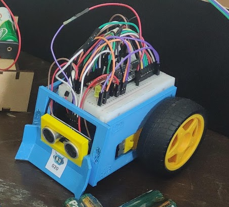

FutureBot is a mini sumo robot made for teaching STEM and making it compete in tournaments. If you do this project, you will learn about robotics, programming, Arduino, electronics, and more. Also, you will be able to customize whatever you want but first we need to learn the basics.

**[Build your robot]({{site.baseurl}})**{: style="font-size: 35px; text-decoration: none;"} Assembly instructions

**[Program your robot]({{site.baseurl}})**{: style="font-size: 35px; text-decoration: none;"} Code your bot to fight

# References
- [Basic-functions-related-to-time-and-interrupts-in-arduino](https://www.electronicwings.com/arduino/basic-functions-related-to-time-and-interrupts-in-arduino) 
- [Arduino-motor-dc-tb6612fng](https://www.luisllamas.es/arduino-motor-dc-tb6612fng/)
- [Program-the-sumo-bot](https://learn.robolink.com/lesson/program-the-sumo-bot/)
- [How-to-make-arduino-sumo-robot](https://create.arduino.cc/projecthub/AhmedAzouz/how-to-make-arduino-sumo-robot-f44bd8)
- [Calculate-time-of-operation-in-arduino](https://www.tutorialspoint.com/calculate-time-of-operation-in-arduino)
- [current-drop](https://forum.arduino.cc/t/arduino-resetting-when-running-2wd-platform-why/59122/2)

# To-Dos

| Task | State |
|-------|--------|
| Add a button to start mandatory countdown | Not implemented |
| Add more ultrasound sensors | Not implemented |
| Add IR sensor functionality | Not implemented |
| Create a PCB capable of handling all sensors | Not implemented |
| Change power supply to a rechargable one | Not implemented |